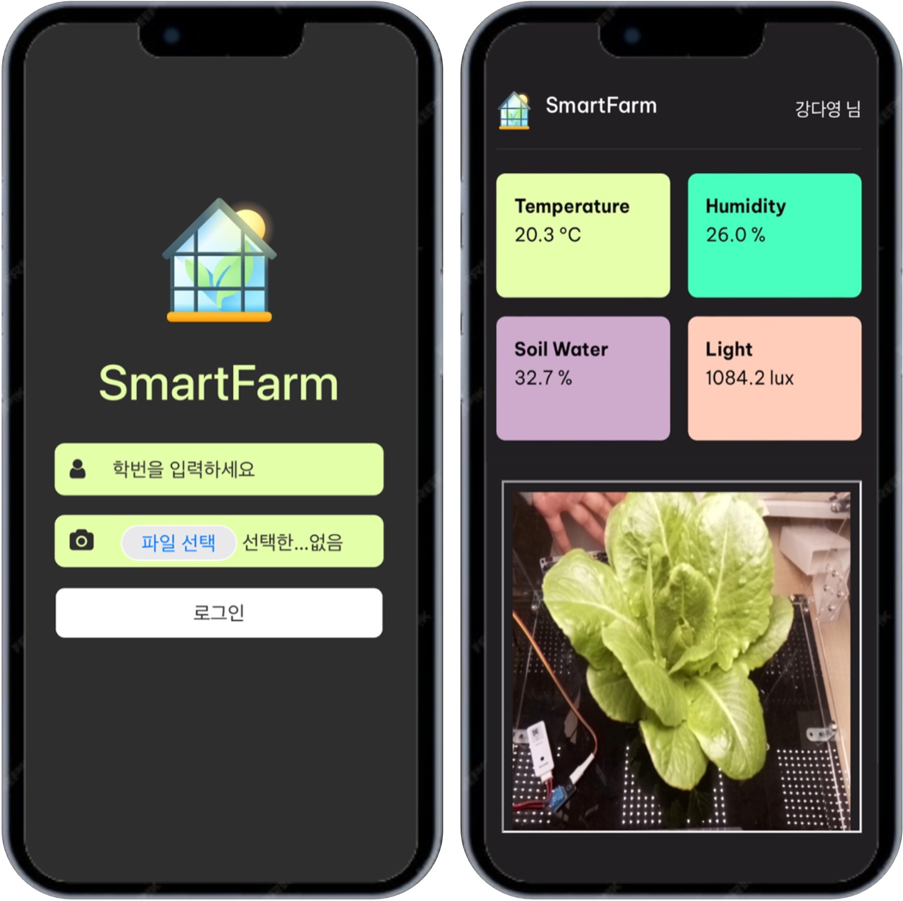

# Mini-Greenhouse Monitoring

<p align="center">
  
</p>

## Description
Enter your student ID, capture user's image and press the login button, facial recognition model will be performed.
This is to verify the facial similarity of the registered image and the captured image.
If the model return "True", you will be taken to the dashboard page where you can view real-time greenhouse environmental data (temperature, humidity, soil moisture content, lights) and internal CCTV.

## Data
- thingspeak: temperature, humidity, soil water content, lights sensor
- raspberrypi: camera v2
- users face image: put image in ./data (file_name &rarr; studentid_name.png)

## Setting
raspberrypi
- cctv code: https://stickode.tistory.com/825
- run and copy address

dashboard.html
- ```line 15``` &rarr; thingspeak url
  - ```url: 'https://api.thingspeak.com/channels/<channel-id>/feeds.csv?api_key=<api_key>&results=1'```
- ```line 88``` &rarr; camera ip address
  - ```<iframe src="<ip_address>" width="100%"></iframe>```

web.py
- ```pip install -r requirements.txt```
- ```python web.py```
